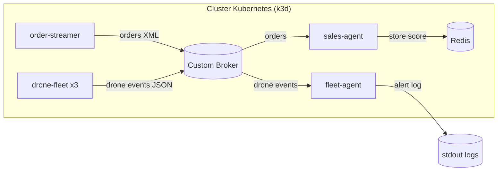

# Introduzione a Kubernetes

Kubernetes e' una piattaforma di orchestrazione per container che automatizza il deploy, la scalabilita e la gestione del ciclo di vita delle applicazioni distribuite. I concetti fondamentali sono:

- Cluster: insieme di nodi (control plane e worker) su cui girano i workload.
- Pod: unita' minima di esecuzione, contiene uno o piu' container con rete e storage condivisi.
- Deployment: descrive lo stato desiderato dei Pod e gestisce rollout e rollback.
- ReplicaSet: garantisce il numero di repliche dei Pod definiti dal Deployment.
- Service: astrazione di rete stabile che espone un gruppo di Pod tramite un nome DNS.
- ConfigMap e Secret: gestiscono configurazioni e segreti esterni ai container.
- Namespace: separa risorse per ambienti o team.

Kubernetes usa un modello dichiarativo: si definisce lo stato desiderato in manifesti YAML, e il control plane lavora per raggiungerlo e mantenerlo. Questo abilita:

- Alta disponibilita: se un Pod cade, viene ricreato automaticamente.
- Scalabilita orizzontale: si aumentano o riducono le repliche senza cambiare il codice.
- Self-healing: probe di liveness/readiness e rescheduling automatico.
- Rollout controllati: aggiornamenti graduali con strategie come RollingUpdate.

In termini di rete, ogni Service espone un endpoint stabile, mentre i Pod possono cambiare IP. Il DNS interno consente comunicazioni tra servizi usando i nomi del Service (es. `custom-broker` o `redis`). Le risorse (CPU e memoria) permettono di limitare e riservare capacità per evitare contese tra i workload.

## Uso di Kubernetes nel progetto

Il progetto usa Kubernetes tramite k3d (K3s in Docker) per simulare un cluster locale e distribuire una architettura a microservizi event-driven. I riferimenti principali sono:

- [cluster-config.yaml](cluster-config.yaml): definisce il cluster k3d con 1 server e 2 agent, porta 8080 esposta dal load balancer e Traefik disabilitato.
- [setup.sh](setup.sh): automatizza la creazione del cluster, build delle immagini, import in k3d e deploy dei manifesti.
- [k8s/deployment.yaml](k8s/deployment.yaml): contiene i Deployment di tutti i servizi e le probe di health.
- [k8s/service.yaml](k8s/service.yaml): definisce i Service ClusterIP per l'esposizione interna.

### Componenti deployati

I Deployment principali sono:

- `order-streamer`: genera ordini XML e li pubblica sulla coda `orders` di Custom Broker. Espone `/health` su porta 8080.
- `sales-agent`: consuma gli ordini dalla coda `orders`, calcola uno score e salva i dati su Redis.
- `drone-fleet`: emette telemetria JSON su `drone.events` con 3 repliche per simulare una flotta distribuita.
- `fleet-agent`: consuma la telemetria e segnala anomalie (batteria bassa, usura elevata, manutenzione).
- `custom-broker`: broker AMQP con porta 5672 e dashboard su 15672.
- `redis`: storage in-memory per gli ordini prioritizzati.

Ogni microservizio ha variabili d'ambiente impostate nei manifesti (es. `RABBITMQ_HOST`, `RABBITMQ_USER`, `REDIS_HOST`) e usa probe di liveness/readiness su `/health`. Le risorse sono esplicitate con `requests` e `limits` per CPU e memoria.

### Flusso logico e comunicazioni

Il flusso e' interamente basato su code Custom Broker:

1. `order-streamer` pubblica ordini su `orders`.
2. `sales-agent` consuma da `orders`, calcola lo score e salva in Redis.
3. `drone-fleet` pubblica telemetria su `drone.events`.
4. `fleet-agent` consuma `drone.events` e produce alert nei log.

Questa architettura disaccoppia producer e consumer, facilita lo scale-out e regge picchi di traffico grazie al buffering delle code.

### Schema architetturale (Mermaid)

### Build e deploy locali

Lo script [setup.sh](setup.sh) esegue:

- `k3d cluster create --config cluster-config.yaml` per creare il cluster locale.
- Build delle immagini dei microservizi in [src](src).
- `k3d image import` per rendere disponibili le immagini nel cluster.
- `kubectl apply -f k8s/` per applicare i manifesti.

Per monitorare:

- Custom Broker dashboard: `kubectl port-forward svc/custom-broker 15672:15672`.
- Log del fleet agent: `kubectl logs -l app=fleet-agent -f`.

### Note sul repository

- In [src](src) sono presenti i microservizi Python che implementano la logica di pub/sub e health check.
- Il file [docker/Dockerfile](docker/Dockerfile) e la app Node in [src/app.js](src/app.js) sono un esempio di immagine multi-stage, ma non sono referenziati dai manifesti in `k8s/`.
