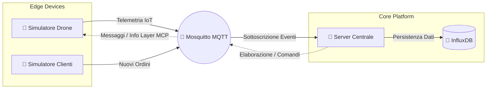
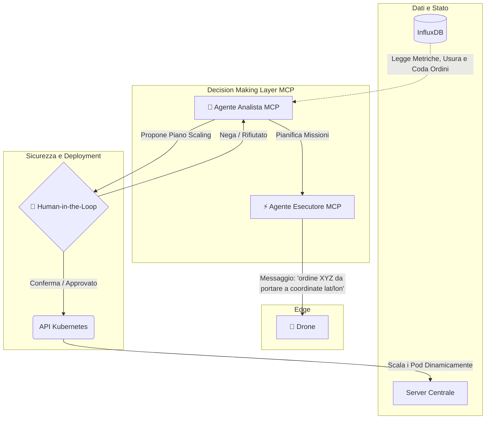

# Progetto Scalable and Reliable Systems: Drone Fleet Delivery System

Questo progetto definisce e implementa l'architettura cloud-native per un sistema avanzato di gestione, monitoraggio e orchestrazione di una flotta di droni incaricata di effettuare consegne autonome. L'infrastruttura è progettata per essere scalabile, tollerante ai guasti e capace di elaborare flussi di dati in tempo reale.

Questo documento funge da panoramica di alto livello dell'architettura del sistema, evidenziando lo stato attuale dell'implementazione ("As-Is") e le imminenti evoluzioni intelligenti ("To-Be").

---

## 🏗️ 1. Architettura Attuale (As-Is)

L'infrastruttura operativa di base si fonda su un modello a microservizi orientato agli eventi, ottimizzato per l'elaborazione di metriche IoT e code di business.

I componenti principali, tutti containerizzati, includono:

*   **🚁 Simulatore del Drone (ex "Sensore Smart"):** 
    *   **Ruolo:** Agisce come Digital Twin dei droni fisici della flotta.
    *   **Funzionamento:** Genera flussi continui ad alta frequenza (stream) di telemetria IoT.
    *   **Payload dei dati:** Include informazioni critiche di volo, tra cui: coordinate spaziali (GPS simulato), percentuale di batteria residua, anomalie hardware e indici di usura dei componenti (es. rotori).

*   **📱 Simulatore dei Clienti (ex "Sensore Non-Smart"):** 
    *   **Ruolo:** Funge da generatore di carico per il business, simulando l'app frontend degli utenti.
    *   **Funzionamento:** Crea e invia un flusso asincrono ma costante di nuovi ordini di spedizione.
    *   **Payload dei dati:** Dettagli pacco, coordinate di ritiro/consegna, e priorità della spedizione.

*   **📨 Message Broker (Eclipse Mosquitto):** 
    *   **Ruolo:** Il cuore della comunicazione pub/sub.
    *   **Vantaggio:** Disaccoppia i flussi di produzione (Simulatori) da quelli di elaborazione, garantendo la delivery dei messaggi MQTT con bassa latenza anche durante i picchi di traffico.

*   **🧠 Server Centrale / Controller:** 
    *   **Ruolo:** Nodo primario di computazione dati.
    *   **Funzionamento:** Agisce come subscriber continuo sui canali MQTT (telemetria e ordini). Effettua controlli di integrità del dato, logica di pre-filtraggio e aggregazione delle metriche, instradando le informazioni verso lo storage persistente.

*   **💾 Storage Layer (InfluxDB):** 
    *   **Ruolo:** Database Time-Series scelto strategicamente per le performance ottimali nell'inserimento e nell'analisi di sequenze temporali.
    *   **Funzionamento:** Memorizza sia le tracce di telemetria (per analisi di durabilità e fault-prediction) sia la coda storica degli ordini dei clienti.

---

## 🚀 2. Evoluzione Intelligente: Il Livello MCP (To-Be)

Il focus della prossima milestone verterà sull'introduzione di logiche di intelligenza artificiale integrando il **Model Context Protocol (MCP)**. L'obiettivo è trasformare il sistema reattivo in un ecosistema proattivo e auto-gestito.

### A. Orchestrazione Logistica e Assegnazione Intelligente
Verranno implementati due Agenti MCP (LLM-based) con ruoli distinti: un **Agente Analista** incaricato di monitorare costantemente la coda globale degli ordini pendenti e lo stato della flotta attiva elaborando strategie, e un **Agente Esecutore** che prenderà in carico l'invio fisico dei comandi. 

L'assegnazione del drone per un determinato ordine *non sarà più casuale*, ma si baserà su ragionamenti complessi dell'Agente, che valuterà per ogni viaggio:
1.  **Profilo Energetico:** Confronto fra la batteria attuale del drone e il budget energetico stimato per completare la rotta (andata e ritorno alla base) + margine di sicurezza.
2.  **Safety & Usura:** Valutazione delle metriche di usura; ai droni con componenti degradati non verranno assegnati pacchi pesanti o missioni a lungo raggio.

### B. Scalabilità Autonoma su Kubernetes (Auto-scaling)
Il sistema dovrà adattarsi ai cambiamenti del contesto, come un aumento imprevisto della domanda. L'Agente monitorerà le metriche aggregate da InfluxDB (es. *Tasso di ordini pendenti troppo alto* o *Esaurimento droni disponibili*).

Di fronte a un'anomalia, l'Agente elaborerà un Piano di Scaling, che può includere:
*   Lo **scale-out orizzontale del Server Centrale** per reggere l'overhead di messaggistica.
*   Lo spawn di **nuovi pod nel cluster Kubernetes** per immettere istantaneamente nuovi Simulatori Drone nella flotta ("flotta elastica").

### C. Human-in-the-Loop (Sicurezza e Conformità)
In ambito DevOps e architetturale, la sicurezza è prioritaria. Nonostante l'autonomia decisionale, è stato stipulato un severo vincolo di design:
*   L'Agente *può proporre* modifiche strutturali (chiamate native alle **API di Kubernetes**).
*   Avviso e interfaccia umana: Qualsiasi piano d'azione che modifichi la topologia del cluster entrerà in stato di *pending*. 
*   **Approvazione.** Solo l'intervento di un operatore umano confermerà la richiesta (meccanismo **Human-in-the-Loop / HITL**), autorizzando infine l'Agente ad applicare il nuovo stato su Kubernetes. Questo garantisce il rispetto del budget e il controllo sui deployment automatici.
